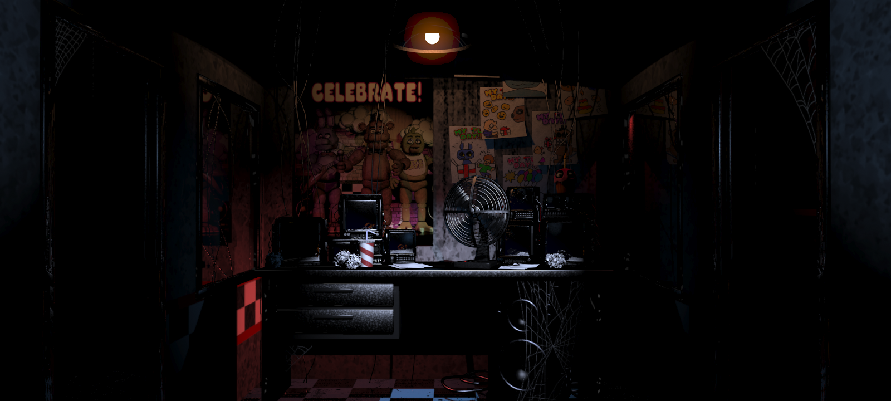
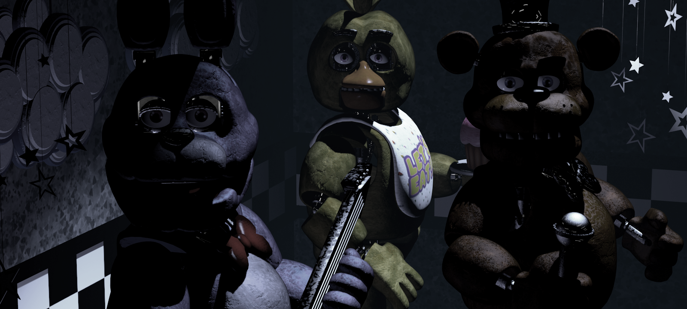
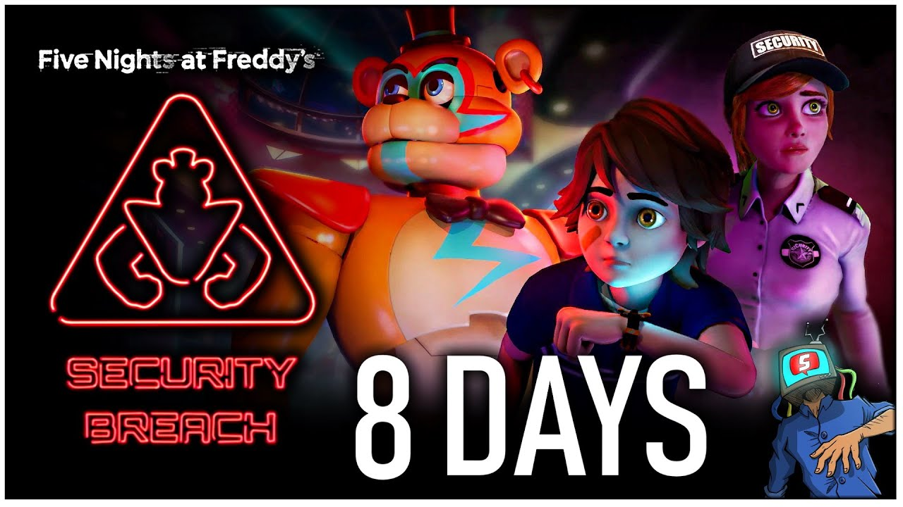
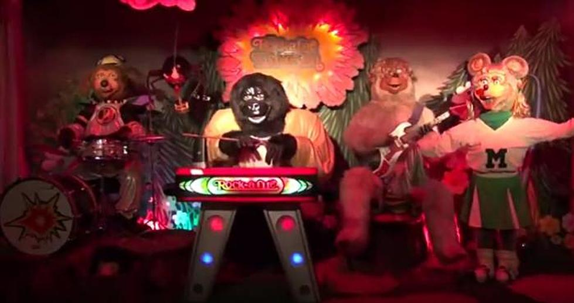

# Amélioration du jeu vidéo ***Five Nights at Freddy's***

## Présentation du jeu
- Jeu multiplateforme
- Meutres dans un restaurant
- Phénomènes paranormaux 
- Survie

## Mécaniques
- Sources lumineuses
- Caméra de sécurité
- Portes automatiques

## Défauts
- Trop enfantin
- Déplacements limités
- Manque de réalisme au fil du temps

## Solutions
- Recréation des personnages 
- Intégration d'éléments retrouvés dans les documentaires criminels
- Inclure des éléments du paranormal (boîte aux esprits par exemple)

